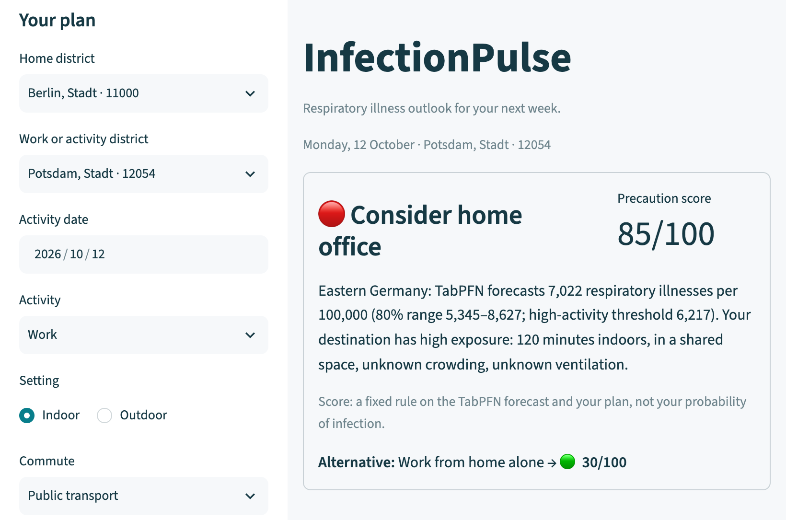
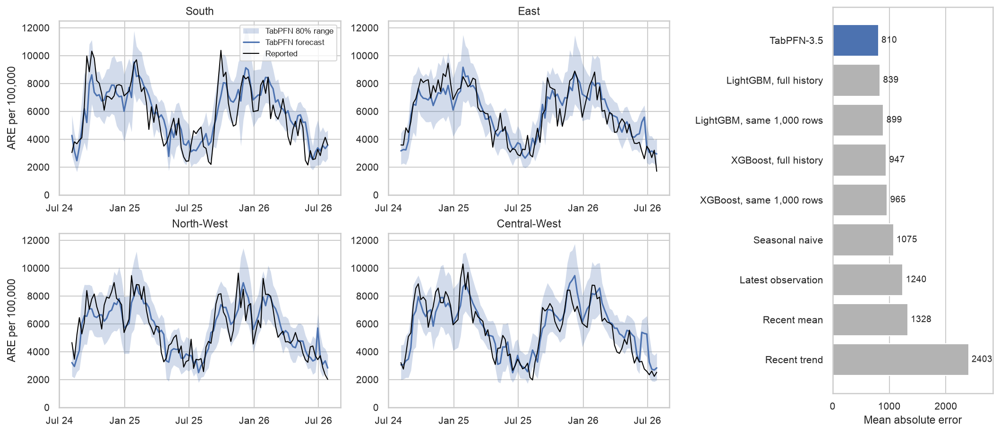
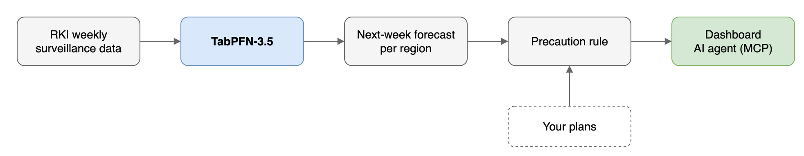

# InfectionPulse

Next-week respiratory illness forecasts for Germany with TabPFN-3.5, turned into a precaution traffic light for your plans.

> *I live in Berlin and take a crowded train to an office in Potsdam. Should I work from home next Monday, or just wear a mask on the train?*



**ARE** (acute respiratory illness) is what we forecast: new cases of fever, cough or sore throat from any cause (flu, COVID-19, RSV, colds) per 100,000 people per week, estimated by the Robert Koch Institute's GrippeWeb survey.

## Results



Locked test, Aug 2024 – Jul 2026, 408 region-weeks, two weeks ahead, using only data public at the time:

| Model | Error (MAE) ↓ | High-activity weeks caught | False alarms |
|---|---:|---:|---:|
| **TabPFN-3.5** (1,000 rows, no tuning) | **810** | **167 / 175** | 35 |
| LightGBM, same 1,000 rows | 899 | 158 / 175 | 36 |
| LightGBM, full history, tuned | 839 | 161 / 175 | 34 |
| Latest observation (no forecast) | 1,240 | 146 / 175 | 50 |

- **9.9% lower error than LightGBM on the same 1,000 rows** (95% CI excludes zero). Against tuned LightGBM on the full history the 3.5% gap is not significant.
- **Why forecast at all:** compared with acting on the latest reported number, TabPFN caught 21 more high-activity weeks with 15 fewer false alarms (exploratory).
- **Checked against reality:** forecasts saved on 17 Sep 2026 had 34.6% lower error than the latest observation once RKI published that week. 3 of 4 regions fell inside the forecast range; South was underestimated (5,787 forecast vs 9,035 reported). One week, preliminary.
- **Small training sets:** with only 104 rows, TabPFN's own ranges stay usable while raw tree quantiles are overconfident; after calibration LightGBM catches up, so this is convenience, not a unique edge.

Details: [benchmark](reports/benchmark.md) · [warnings](reports/alert_report.md) · [live check](reports/live_forecast_check.md) · [small training sets](reports/small_training_sets.md) · [16-state flu/RSV pilot](reports/state_report.md)

## How it works



TabPFN-3.5 predicts the 10th, 50th and 90th percentile of next week's illness rate per region from 14 features (recent weeks, trend, last year, season, region). The 0–100 score is not a model output: a fixed, published rule maps the forecast level (low/moderate/high) and your exposure (commute, workplace) to one of nine scores ([table](docs/technical-guide.md#precaution-policy)). It is a precaution level, not an infection probability.

Every forecast is saved before its week starts and scored once RKI publishes the outcome (`scripts/score_live.py`, `scripts/check_live_forecasts.py`).

## Quickstart

No API token needed; the app reads the saved forecast in the repo.

```bash
python3.12 -m venv .venv && source .venv/bin/activate
pip install -r requirements.txt -c requirements-lock.txt -e .   # macOS: brew install libomp
streamlit run app.py               # dashboard
python scripts/morning_brief.py --replay   # example brief from a recorded forecast
python scripts/serve.py                    # REST + MCP tools for AI agents
```

The repo ships the live TabPFN forecast for 12–18 Oct 2026. After that week the app opens on a clearly labelled **recorded example** (the real forecast issued 17 Sep 2026); refresh with `python scripts/refresh.py --forecast-now --max-api-units 20000` (needs `TABPFN_TOKEN`).

## Datasets

| Dataset | Used for | License |
|---|---|---|
| [RKI GrippeWeb](https://github.com/robert-koch-institut/GrippeWeb_Daten_des_Wochenberichts) — weekly acute respiratory illness per 100,000, 4 regions | Model target and features | CC BY 4.0 |
| [RKI influenza cases](https://github.com/robert-koch-institut/Influenzafaelle_in_Deutschland) — weekly notifications per state | Dashboard context, state pilot | CC BY 4.0 |
| [RKI RSV cases](https://github.com/robert-koch-institut/Respiratorische_Synzytialvirusfaelle_in_Deutschland) — weekly notifications per state | Dashboard context, state pilot | CC BY 4.0 |
| [RKI COVID-19 7-day incidence](https://github.com/robert-koch-institut/COVID-19_7-Tage-Inzidenz_in_Deutschland) — per district | Dashboard context | CC BY 4.0 |
| [Destatis district list](https://www.destatis.de/DE/Themen/Laender-Regionen/Regionales/Gemeindeverzeichnis/_inhalt.html) | Location search | [DL-DE-BY 2.0](https://www.govdata.de/dl-de/by-2-0) |
| [Eurostat GISCO NUTS 2024](https://ec.europa.eu/eurostat/web/gisco/geodata/statistical-units/territorial-units-statistics) | Map of German states | © EuroGeographics |

## Reproduce

```bash
python scripts/make_results_figure.py       # figure above, from committed CSVs
python scripts/short_history_benchmark.py   # 104-row experiment (needs the local run in models/)
python -m pytest -q                         # test suite
```

The full pipeline downloads RKI data and calls the TabPFN API (set `TABPFN_TOKEN` in `.env`):

```bash
python scripts/respiratory_data.py refresh && python scripts/respiratory_data.py build
python scripts/respiratory_benchmark.py prepare
python scripts/respiratory_benchmark.py run --max-api-units 160000
python scripts/report.py
```

More: [technical guide](docs/technical-guide.md) · [agent setup](docs/agent-setup.md)

## Limitations

- Germany only. Going worldwide means adding each country's surveillance data; the features and TabPFN setup are not Germany-specific.
- Four broad regions, not districts; RKI data is weekly.
- Retrospective test over two seasons; one week of live evidence so far.
- The precaution rule is a heuristic, not clinically validated.

Built for the Prior Labs TabPFN-3.5 Hackathon. Code licensed under [Apache 2.0](LICENSE).
