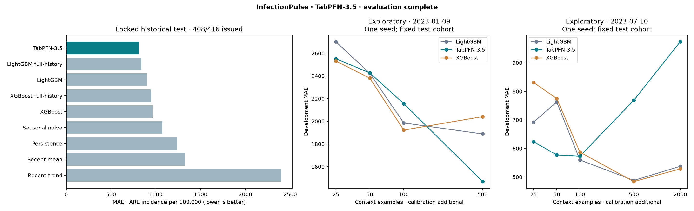

# Measured ARE benchmark

TabPFN MAE improvement versus the strongest baseline (LightGBM full-history): 3.5%. The predeclared >=5% and positive paired 95% interval criterion does not pass.

Run `65cf524d3927a4b8`; status **complete**. 408 of 416 planned region-weeks issued; abstentions: `{"source_stale": 8}`.

| Model | MAE | RMSE | Brier | Raw 10–90% coverage | Adjusted 80% coverage | Adjusted width |
|---|---:|---:|---:|---:|---:|---:|
| TabPFN-3.5 | 809.98 | 1029.82 | 0.2000 | 86.5% | 86.5% | 3093.81 |
| LightGBM full-history | 838.92 | 1054.32 | 0.2053 | 84.1% | 84.1% | 2962.27 |
| LightGBM | 899.09 | 1136.65 | 0.2224 | 78.7% | 81.1% | 2948.66 |
| XGBoost full-history | 947.09 | 1206.98 | 0.2304 | 85.0% | 85.0% | 3479.81 |
| XGBoost | 965.13 | 1236.87 | 0.2338 | 82.1% | 82.6% | 3321.14 |
| Seasonal naive | 1075.03 | 1325.46 | 0.2325 | 82.1% | 82.1% | 3688.94 |
| Persistence | 1240.14 | 1571.11 | 0.2525 | 77.9% | 77.9% | 3681.79 |
| Recent mean | 1328.02 | 1665.44 | 0.3007 | 76.7% | 76.7% | 3928.95 |
| Recent trend | 2402.82 | 3031.62 | 0.2386 | 83.3% | 83.3% | 7108.00 |



## Interpretation

Raw coverage describes the q10–q90 band shown by the app and used by its precaution rule. Adjusted coverage and width describe the separately evaluated conformal interval; they must not be attributed to the raw band.

Forecast features in the locked test use actual historical source vintages. Publication times use Git commit timestamps as a proxy. Pre-September-2023 development/training features are explicitly reconstructed; they are not prospective evidence. Labels use the first published vintage at least 35 days after target Sunday. Four-week block bootstrap intervals preserve time dependence and keep all regions together.

The exploratory ladder has one seed and two predetermined development origins, with N=2000 only where enough history exists. It cannot establish robust small-sample superiority on its own.

These metrics validate community surveillance forecasts, not personal infection probabilities or the clinical effectiveness of the traffic-light policy.

## Probability readiness

Numerical community-event probabilities are withheld unless all predeclared readiness checks pass. The reliability-error ceiling is 0.05; passing the discrimination metrics alone is insufficient.

```json
{
  "ready": false,
  "checks": {
    "at_least_20_events": true,
    "at_least_20_nonevents": true,
    "brier_beats_seasonal_frequency": true,
    "precision_recall_lift": true,
    "reliability_error_at_most_005": "False"
  },
  "reliability_ece": 0.05324006769592867,
  "validation": "locked retrospective community-event evaluation; not individual infection probability"
}
```

## Paired comparisons

```json
[
  {
    "competitor": "Persistence",
    "paired_rows": 408,
    "mae_improvement": 430.16639839934294,
    "ci95": [
      298.9641132009959,
      580.9436721087424
    ],
    "method": "paired moving four-week blocks; all macroregions together"
  },
  {
    "competitor": "Seasonal naive",
    "paired_rows": 408,
    "mae_improvement": 265.0585552620881,
    "ci95": [
      114.24911794189984,
      424.5655326016313
    ],
    "method": "paired moving four-week blocks; all macroregions together"
  },
  {
    "competitor": "Recent mean",
    "paired_rows": 408,
    "mae_improvement": 518.0463003601272,
    "ci95": [
      353.15802820063465,
      693.7363894200098
    ],
    "method": "paired moving four-week blocks; all macroregions together"
  },
  {
    "competitor": "Recent trend",
    "paired_rows": 408,
    "mae_improvement": 1592.8453199679707,
    "ci95": [
      1358.2505547723288,
      1917.371725579367
    ],
    "method": "paired moving four-week blocks; all macroregions together"
  },
  {
    "competitor": "LightGBM",
    "paired_rows": 408,
    "mae_improvement": 89.11890514992132,
    "ci95": [
      2.0057783248897736,
      181.10890788506762
    ],
    "method": "paired moving four-week blocks; all macroregions together"
  },
  {
    "competitor": "XGBoost",
    "paired_rows": 408,
    "mae_improvement": 155.15616446273407,
    "ci95": [
      53.244739033552065,
      268.2669923253796
    ],
    "method": "paired moving four-week blocks; all macroregions together"
  },
  {
    "competitor": "LightGBM full-history",
    "paired_rows": 408,
    "mae_improvement": 28.944699957538806,
    "ci95": [
      -53.64575311640252,
      116.90749649443974
    ],
    "method": "paired moving four-week blocks; all macroregions together"
  },
  {
    "competitor": "XGBoost full-history",
    "paired_rows": 408,
    "mae_improvement": 137.1138024760776,
    "ci95": [
      36.54769137130576,
      241.55853408483574
    ],
    "method": "paired moving four-week blocks; all macroregions together"
  }
]
```
