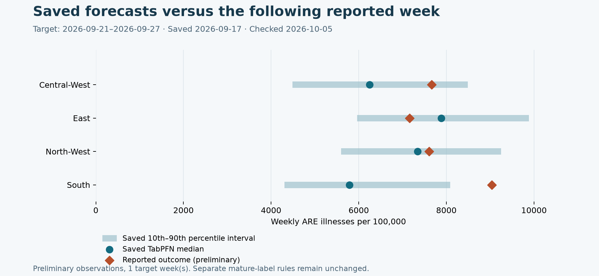

# First check of forecasts saved before their target week

Checked **2026-10-05T13:11:01.755864+00:00** against the latest available RKI releases. No model was rerun, and the saved forecasts were unchanged (file checksums in the JSON report). This is a **preliminary latest-release check**, separate from the mature-label benchmark.

## Regional respiratory illness (ARE)

| Region | Saved median | Saved 10th–90th percentiles | Reported outcome | Absolute error | Inside interval? |
|---|---:|---:|---:|---:|---|
| South | 5,787 | 4,305–8,087 | 9,035 | 3,248 | No |
| East | 7,881 | 5,964–9,887 | 7,157 | 724 | Yes |
| North-West | 7,344 | 5,601–9,250 | 7,609 | 265 | Yes |
| Central-West | 6,250 | 4,487–8,490 | 7,663 | 1,413 | Yes |

**ARE: 4/4 outcomes available**, 0 pending or excluded.
MAE: **1,412.6**; RMSE: **1,812.7**; outcomes within saved 10th–90th intervals: **3/4**.
On 4 matched outcomes, carrying forward the last originally available observation gives MAE **2,158.2**, versus TabPFN **1,412.6** (34.6% lower). This is a simple persistence reference, not a new LightGBM/XGBoost comparison.
The saved median flagged 3/4 regions whose reported outcome exceeded the fixed historical high-burden threshold.

**INFLUENZA: 0/16 outcomes available**, 16 pending or excluded.

The largest miss was **South**: predicted 5,787, reported 9,035 illnesses per 100,000. Its outcome was outside the saved interval. All 4 observed rows are shown; no region was removed because of its error.

## Outcome provenance

- ARE: published 2026-10-01T07:08:29+00:00; [exact public release](https://raw.githubusercontent.com/robert-koch-institut/GrippeWeb_Daten_des_Wochenberichts/998e5196a5c86e6b01782c31af3fb002827f077b/GrippeWeb_Daten_des_Wochenberichts.tsv); SHA256 `d91255cefd4852a72f9e444dee462e7cf0855d85d54442b05cd87691b87bf501`.

- INFLUENZA: published 2026-10-01T06:00:21+00:00; [exact public release](https://raw.githubusercontent.com/robert-koch-institut/Influenzafaelle_in_Deutschland/e52c7a9ac0e9369dbe25e42d571a4958ca3114cc/IfSG_Influenzafaelle.tsv); SHA256 `82648495d8f64fbbd0e267b5d42eecc55f65eb1e988e9f8919183de3dd5c16b3`.

Still awaiting publication: 16 forecasts, for influenza 2026-09-28–2026-10-04. The available releases do not yet contain these outcomes. No earlier week is substituted.

Mature-label eligibility begins at 2026-11-02T00:00:00+01:00, 2026-11-09T00:00:00+01:00; scoring still requires a public release on or after the respective cutoff.

## What this supports

This is evidence that forecasts were saved before a later reported outcome and can be checked transparently. It is one preliminary forecast week, not proof of general superiority, calibrated personal risk or prevented infections.

- Latest reported outcomes remain provisional; scripts/score_live.py's original 35-day mature-label gate is unchanged.
- Four ARE regions in one week are correlated, not four independent trials or evidence of general superiority.
- Persistence is reconstructed from the exact original input release, not a newly trained competing model.
- Missing or unpublished outcomes are pending, never treated as zero.
- This evaluates community illness forecasts, not individual infection risk or the benefit of staying home.

Reproduce after public-data refresh: `python scripts/check_live_forecasts.py`. The original mature-label scorer remains `python scripts/score_live.py`.
